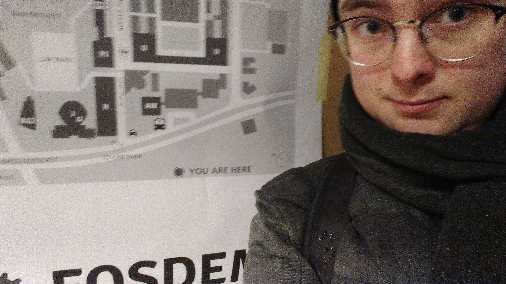
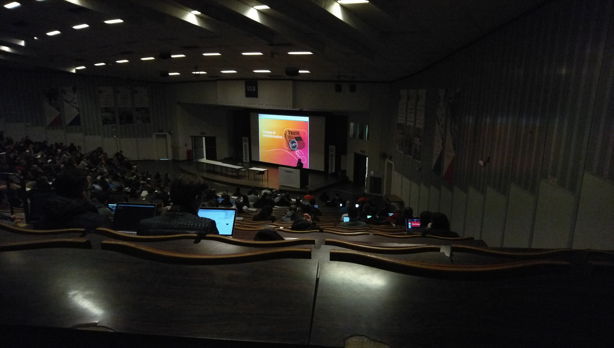
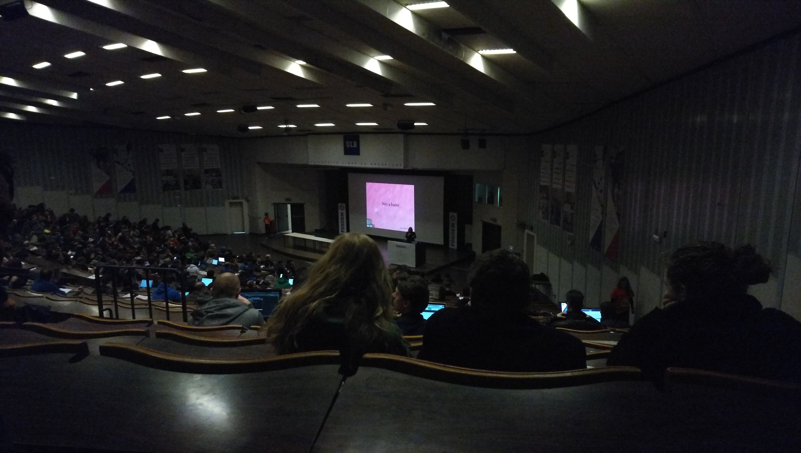
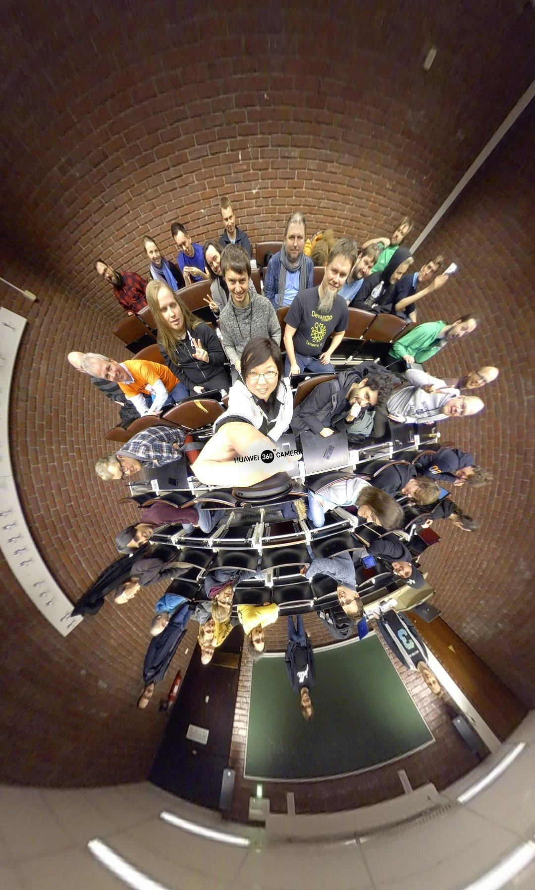
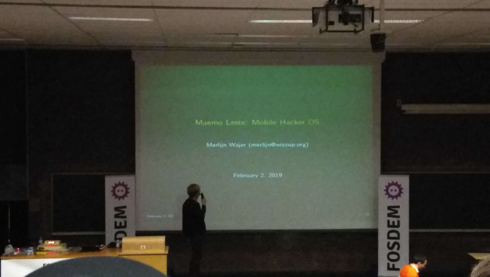
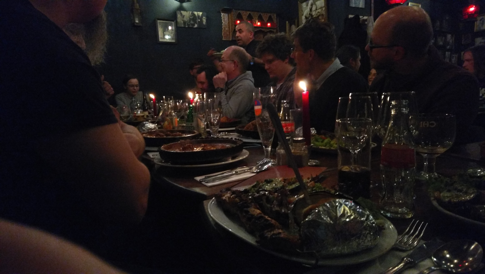

# Visiesystemen: seminars portfolio

_Van Assche Dylan_
_Master-ICT_
_Campus De Nayer (KU Leuven) 2018 - 2019_

## Seminars

| Seminar    								 													|  Date   					| Location 				| Assigned time	|
| :------------------------------------------------------------------------------------------------------------------------------------------------ | :----------------------------------: | :----------------------------------:  | ----------------------: |
|  Introductie EAVISE 3D onderzoek (Patrick Vandewalle)												| 05/10/2018 12u45 - 13u45	| Campus De Nayer		| 1 hour			|
|  An application of logic-based methods to machine component design (Bram Aerts)						| 12/10/2018 12u45 - 13u45	| Campus De Nayer		| 1 hour			|
|  Preserving privacy by checking how low can you go with deep (Timothy Callemein)						| 19/10/2018 12u45 - 13u45	| Campus De Nayer		| 1 hour			|
|  Reconstruction of building interiors from cluttered pointclouds (Inge Coudron)							| 26/10/2018 12u45 - 13u45	| Campus De Nayer		| 1 hour			|
|  Diamond re-identification (Dries Hulens)															| 09/11/2018 12u45 - 13u45	| Campus De Nayer		| 1 hour			|
|  Hands-on seminar: Modern Software Development (ALTRAN)											| 15/11/2018 13u45 - 17u45	| Campus De Nayer		| 3 hours			|
|  Optimizing deep learned object detection for industrial applications (Robin Schrijvers)						| 16/11/2018 12u45 - 13u45	| Campus De Nayer		| 1 hour			|
|  Knowledge Base Paradigm Applied to School Timetabling and Other Scheduling Problems (Kylian Van Dessel)	| 23/11/2018 12u45 - 13u45 	| Campus De Nayer		| 1 hour			|
|  Quick and clean deep learning classifier improvements with SVMs (Floris De Feyter)						| 30/11/2018 12u45 - 13u45  	| Campus De Nayer		| 1 hour			|
|  Energy Imbalance Price Peak Prediction Using FFT-Features (Laurent Mertens)							| 07/12/2018 12u45 - 13u45    | Campus De Nayer		| 1 hour			|
|  Low latency object detection with 16-bit float and 8-bit integer networks (Maarten Vandersteegen)			| 14/12/2018 12u45 - 13u45    | Campus De Nayer		| 1 hour			|
|  FOSDEM 2019 in Brussels: see below															| 02/02/2019 10u00 - 23u00	| ULB Campus du Solbosch	| TBD			|

**Minimum amount of seminars hours to pass this class:** 15 hours
**Total amount of seminars hours:** 13 + FOSDEM hours

## FOSDEM 2019 

| Talk/meeting							 														|  Date   					| Location 				|
| :------------------------------------------------------------------------------------------------------------------------------------------------ | :----------------------------------: | -----------------------------------:  |
| FLOSS, the Internet and the Future (Mitchell Baker)													| 02/02/2019 11u00 - 11u50	| Janson room, building J	|
| Blockchain: The Ethical Considerations (Deb Nicholson)												| 02/02/2019 12u00 - 12u50	| Janson room, building J	|
| Sailfish OS community meeting (Jolla)															| 02/02/2019 14u00 - 16u30	| BoF room, building H		|
| Maemo Leste (Merlijn B. W. Wajer)																| 02/02/2019 17u20 - 17u35	| Ferrer room, H.2215		|
| Purism community meeting (Purism)																| 02/02/2019 18u00 - 18u30	| BoF room, building J		|
| Sailfish OS community diner (Jolla)																| 02/02/2019 19u30 - 23u00	| La Kasbah, Brussels		|

### Pictures
*Arrived at FOSDEM 2019*

*FLOSS, the Internet and the Future*

*Blockchain: The Ethical Considerations*

*Sailfish OS community meeting*

*Maemo Leste*

*Sailfish OS community diner*

## Sources
- [https://fosdem.org/2019/schedule/](https://fosdem.org/2019/schedule/)
- [https://fosdem.org/2019/schedule/track/lightning_talks/](https://fosdem.org/2019/schedule/track/lightning_talks/A)
- [https://together.jolla.com/question/195719/fosdem-2019/](https://together.jolla.com/question/195719/fosdem-2019/+)
- [https://together.jolla.com/question/195719/fosdem-2019/?answer=198011#post-id-198011](https://together.jolla.com/question/195719/fosdem-2019/?answer=198011#post-id-198011)
- [https://iiw.kuleuven.be/onderzoek/eavise/seminars](https://iiw.kuleuven.be/onderzoek/eavise/seminars)
- Birds of a Feather (BoF) rooms are announced on the FOSDEM event itself.